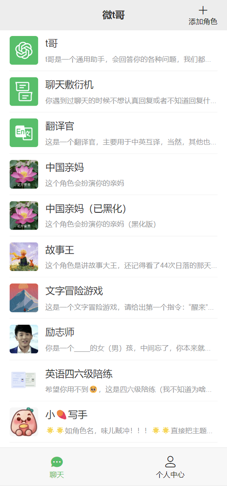
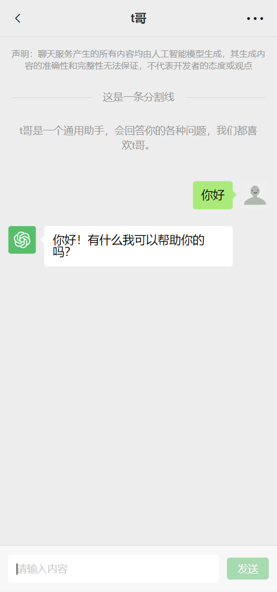
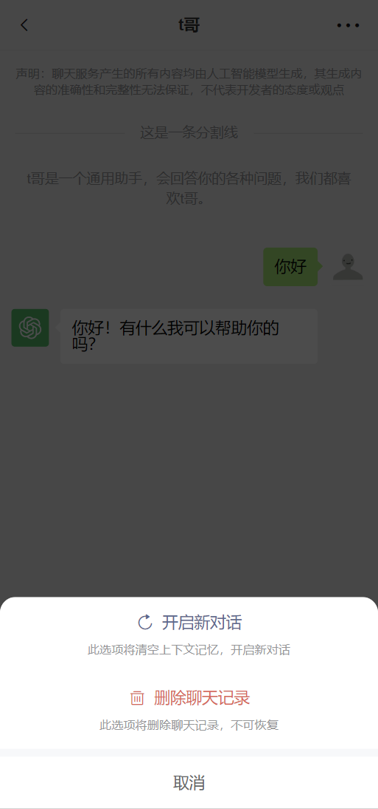
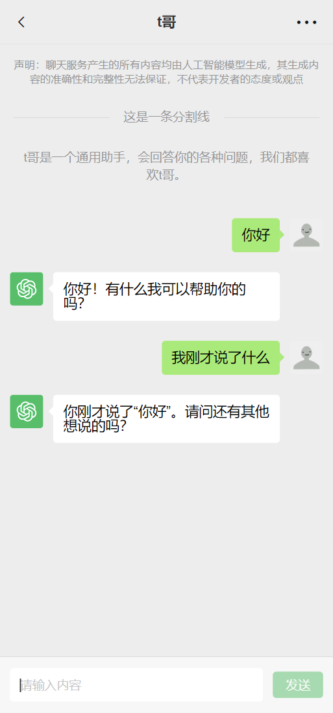
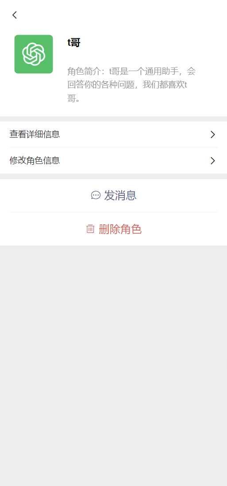
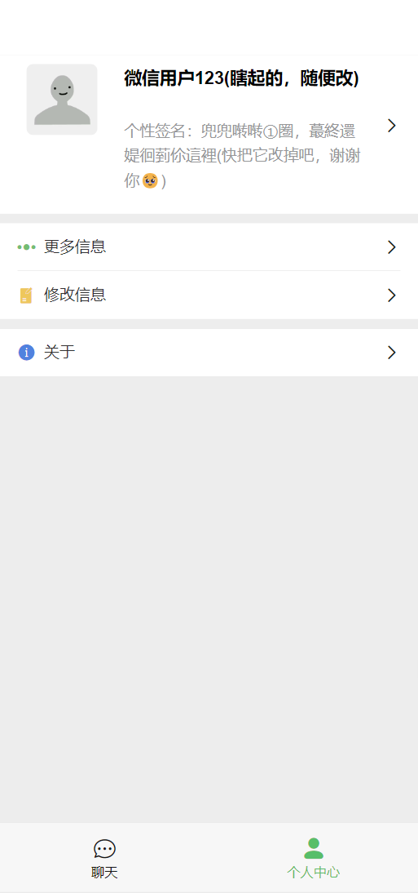
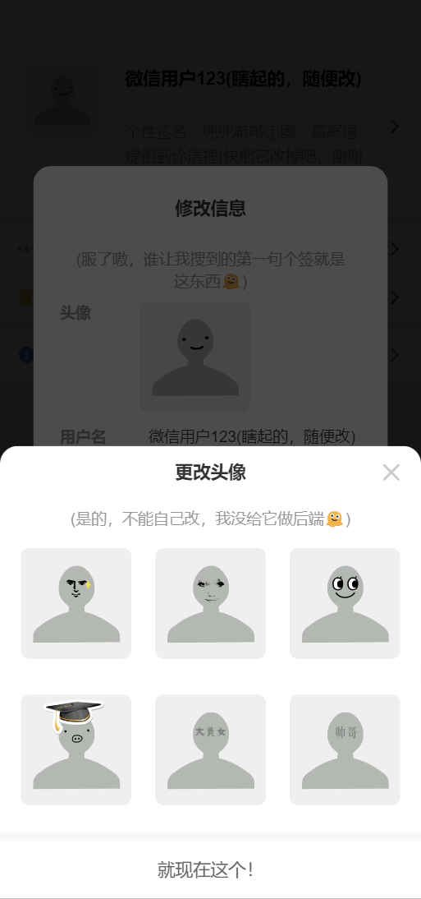
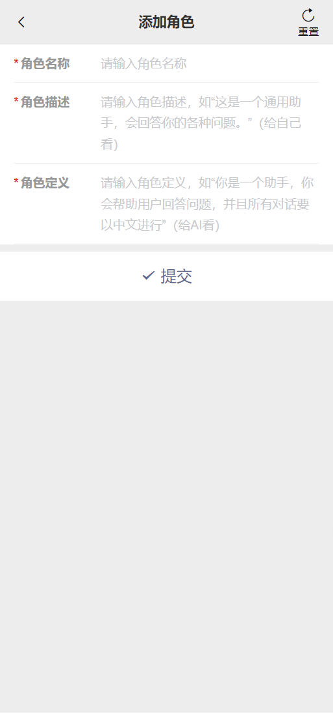

# 微 t 哥——vue 版

**微 t 哥**是一个可以跟 ChatGPT 聊天的 App，这款小程序名字中的“微”字与整体界面的设计风格有关（见下图），我自不必多说，“t 哥”则是我给 ChatGPT 的别名 🤯，`npm run build`后可部署服务器或用 Hbuilderx 打包 H5+app，微信小程序（uniapp）版可查看我的另一个仓库，别问为啥没上架微信小程序，因为**个人版小程序**不支持 AI 相关 😡。

## 技术栈

-   本项目由**纯前端**完成，不依赖后端数据库和接口，只需调用 OpenAI 的官方接口，见 [ChatGPT API 文档](https://openai.apifox.cn/)。
-   [vue3](https://cn.vuejs.org/)
-   [Vant4](https://vant-ui.github.io/vant/#/zh-CN)（组件库）
-   [Vite](https://cn.vitejs.dev/)（构建工具）
-   [tailwindcss](https://tailwindcss.com/)（css 框架）
-   [pinia](https://pinia.vuejs.org/zh/)（状态管理）

## 项目预览











## 快速上手

> 注意：需在./src/stores/inSupportStatus.ts 文件中配置好自己的 OpenAI API Key，或添加获取 apiKey 的方法，否则聊天功能无法使用，同时该 stores 支持设置是否支持聊天功能的全局变量。

### we-t-ge-vue

This template should help get you started developing with Vue 3 in Vite.

#### Recommended IDE Setup

[VSCode](https://code.visualstudio.com/) + [Volar](https://marketplace.visualstudio.com/items?itemName=Vue.volar) (and disable Vetur).

#### Type Support for `.vue` Imports in TS

TypeScript cannot handle type information for `.vue` imports by default, so we replace the `tsc` CLI with `vue-tsc` for type checking. In editors, we need [Volar](https://marketplace.visualstudio.com/items?itemName=Vue.volar) to make the TypeScript language service aware of `.vue` types.

#### Customize configuration

See [Vite Configuration Reference](https://vitejs.dev/config/).

#### Project Setup

```sh
yarn
```

##### Compile and Hot-Reload for Development

```sh
yarn dev
```

##### Type-Check, Compile and Minify for Production

```sh
yarn build
```

## 素材来源

-   部分头像及图标：iconfont.cn
-   用户头像及默认角色头像图片素材：小 🍠——月小七 🍬（小 🍠 号：Jelly777）
-   “中国亲妈”头像图片素材：小 🍠——星光慧慧子（小 🍠 号：cmh188o）
-   “故事王”头像图片素材：小 🍠——Oneone（小 🍠 号：4272273487）
-   “文字冒险游戏”头像图片素材：小 🍠——梦境匠人 H.Po（小 🍠 号：9624138367）
-   “励志师”头像图片素材：《爱情公寓》截图
-   “小 🍠 写手”头像图片素材：小 🍠 表情
-   “彩蛋”图片：小 🍠——Uynixgnaw（小 🍠 号：849299507）

    （素材来源于网络，如有侵权及时删除）
